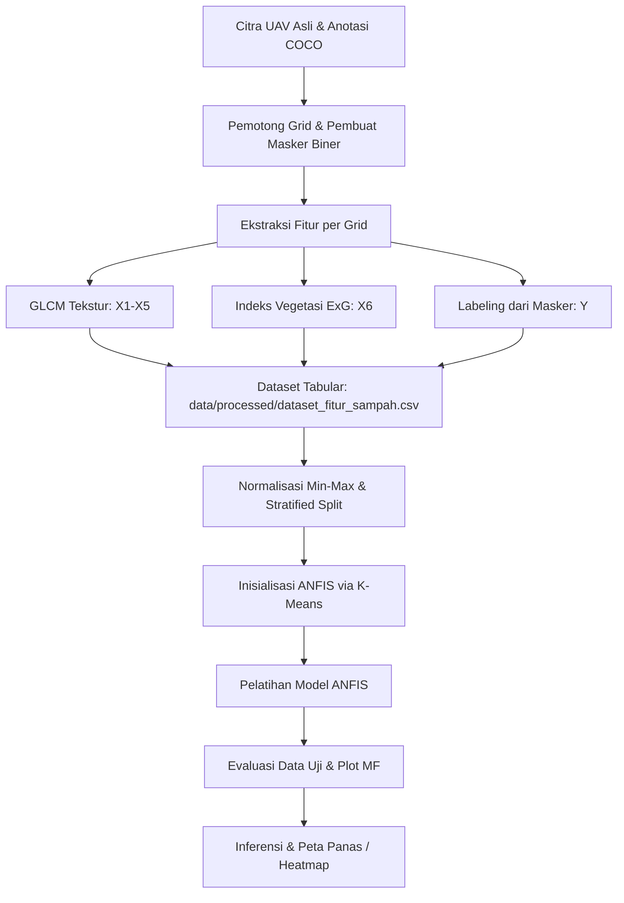

# Dokumentasi Alur Kerja (Pipeline Flow) Proyek Deteksi Sampah UAV dengan ANFIS

Dokumen ini menjelaskan secara menyeluruh alur kerja (*pipeline flow*), pemrosesan data, arsitektur pemodelan, hingga rekonstruksi peta keputusan akhir pada proyek **Citra UAV untuk Deteksi Sampah Menggunakan Sistem Inferensi Logika Ganda (ANFIS)**.

---

## 1. Ikhtisar Arsitektur Sistem

Proyek ini menggabungkan teknik pengolahan citra (*computer vision*) konvensional untuk ekstraksi fitur spasial dan arsitektur pembelajaran mendalam hibrida **Adaptive Neuro-Fuzzy Inference System (ANFIS)** untuk klasifikasi multi-kelas sebaran sampah.

Secara garis besar, alur kerja sistem digambarkan pada diagram berikut:



---

## 2. Rincian Alur Pemrosesan Data (Preprocessing)

### A. Konversi Anotasi ke Masker Biner (Ground Truth Mask)
*   **Input**: Berkas anotasi COCO JSON (`data/raw/annotations/dronewaste_v2.0.json`).
*   **Proses**: Membaca koordinat segmen poligon sampah dari metadata gambar, lalu melukis poligon tersebut ke dalam matriks kosong berukuran sama dengan gambar asli. Area sampah diberi nilai piksel `255` (putih) dan latar belakang diberi nilai `0` (hitam).
*   **Output**: Masker biner segmentasi yang bersih untuk setiap citra.

### B. Pemotongan Grid (Grid Splitting)
*   Untuk memproses citra UAV beresolusi tinggi secara lokal dan terarah, citra RGB dan masker biner dipotong menggunakan jendela geser (*sliding window*) non-overlapping berukuran `256 x 256` piksel.
*   Grid yang berada di tepian citra dan berukuran kurang dari `256 x 256` diabaikan untuk menjaga konsistensi dimensi masukan.

### C. Ekstraksi Fitur Input ($X_1$ s.d. $X_6$)
Setiap grid citra RGB diekstrak fiturnya secara independen tanpa menggunakan masker ground truth (masker hanya digunakan untuk pelabelan target saat latihan):
1.  **Fitur Tekstur GLCM ($X_1 - X_5$)**: Grid dikonversi ke skala abu-abu (*grayscale*). Matriks ko-okurensi tingkat abu-abu (*Gray-Level Co-occurrence Matrix*) dihitung pada jarak $d=1$ piksel untuk empat arah sudut ($0^\circ, 45^\circ, 90^\circ, 135^\circ$). Nilai-nilai statistik dirata-ratakan secara isotropik untuk menghasilkan:
    *   **$X_1$ (Entropy)**: Mengukur derajat ketidakberaturan tekstur grid.
    *   **$X_2$ (Contrast)**: Mengukur perbedaan intensitas lokal.
    *   **$X_3$ (Homogeneity)**: Mengukur keseragaman nilai piksel yang berdekatan.
    *   **$X_4$ (Energy)**: Mengukur tingkat konsentrasi keabuan (keseragaman sudut kedua).
    *   **$X_5$ (Correlation)**: Mengukur ketergantungan linier nilai abu-abu piksel bertetangga.
2.  **Fitur Warna / Vegetasi ($X_6$ - Excess Green)**:
    Untuk membedakan tanaman/pepohonan rimbun yang memiliki tekstur kasar dari tumpukan sampah yang juga bertekstur kasar, dihitung indeks vegetasi ExG menggunakan rumus:
    $$ExG = 2 \cdot G - R - B$$
    Nilai rata-rata dari seluruh piksel dalam grid dijadikan fitur $X_6$.

### D. Pelabelan Target ($Y\_Target$)
Persentase luas wilayah sampah dihitung dari perbandingan piksel putih (`255`) terhadap total piksel pada potongan masker biner grid bersangkutan:
*   **Kelas 0 (Aman/Bersih)**: Kepadatan sampah $< 5\%$
*   **Kelas 1 (Sampah Tersebar Ringan)**: $5\% \le \text{Kepadatan} \le 40\%$
*   **Kelas 2 (Klaster Kritis / Padat)**: Kepadatan $> 40\%$

### E. Pengurangan Citra Tanpa Anotasi (Image Dataset Reduction)
*   **Masalah Ketidakseimbangan**: Karena sebagian besar wilayah pada citra UAV berisi lahan bersih (background), ekstraksi grid menghasilkan jumlah data **Kelas 0 (Aman/Bersih)** yang sangat dominan.
*   **Solusi**: Citra tanpa anotasi dihapus dari folder dataset dan entri `images` kosong pada COCO JSON dipangkas agar proses ekstraksi tidak memproses citra latar belakang murni yang memberatkan komputasi.
*   **Hasil Akhir**: Dataset akhir memiliki total **4.684 baris** yang tidak sepenuhnya seimbang (Kelas 0: 2.399 baris [51.22%]; Kelas 1: 1.120 baris [23.91%]; Kelas 2: 1.165 baris [24.87%]), disimpan ke dalam berkas `data/processed/dataset_fitur_sampah.csv`.

---

## 3. Normalisasi Fitur & Pembagian Dataset

*   **Normalisasi Min-Max**: Karena rentang nilai antar-fitur berbeda sangat jauh, seluruh fitur masukan diskalakan ke rentang $[0, 1]$ agar pelatihan model stabil:
    $$X_{\text{norm}} = \frac{X - X_{\text{min}}}{X_{\text{max}} - X_{\text{min}}}$$
    Parameter `min` dan `max` dari data latih disimpan ke dalam berkas `models/scaler_params.pkl` untuk digunakan kembali saat proses inferensi.
*   **Pembagian Data Terstratifikasi**: Dataset dibagi menggunakan rasio:
    *   **Data Uji (Testing)**: 20% dari total dataset.
    *   **Data Latih (Training)**: 68% dari total dataset (85% dari bagian latihan).
    *   **Data Validasi (Validation)**: 12% dari total dataset (15% dari bagian latihan).
    Proporsi kelas dipertahankan di ketiga pembagian data tersebut.

---

## 4. Pemodelan Fuzzy ANFIS (Arsitektur & Teori)

Model ANFIS mengombinasikan logika fuzzy dengan jaringan saraf tiruan melalui arsitektur **Takagi-Sugeno-Kang (TSK) Orde 1**.

```
[Fitur X] ➔ [L1: Fuzzifikasi (Gaussian)] ➔ [L2: Rule Firing] ➔ [L3: Normalisasi] ➔ [L5: Defuzzifikasi] ➔ [Logits Kelas]
                                                                        ▲
                                        [L4: Konsekuen TSK] ────────────┘
```

### Penjelasan 5 Layer ANFIS:

1.  **Layer 1 (Fuzzifikasi)**:
    Menghitung derajat keanggotaan fuzzy dari setiap fitur input menggunakan kurva keanggotaan Gaussian:
    $$\mu_{ij}(x_j) = \exp\left( -0.5 \cdot \left( \frac{x_j - \mu_{ij}}{\sigma_{ij}} \right)^2 \right)$$
    *   $\mu_{ij}$ (`self.mu`): Nilai pusat kurva aturan ke-$i$ untuk fitur ke-$j$.
    *   $\sigma_{ij}$ (`self.sigma`): Lebar kurva aturan ke-$i$ untuk fitur ke-$j$. Agar $\sigma$ selalu bernilai positif, dilakukan transformasi `softplus` pada parameter raw: $\sigma = \text{softplus}(\sigma_{\text{raw}}) + 10^{-6}$.
2.  **Layer 2 (Rule Firing Strength)**:
    Mengkombinasikan derajat keanggotaan seluruh fitur untuk setiap aturan fuzzy menggunakan operator AND berupa perkalian (*product T-norm*):
    $$w_i(x) = \prod_{j=1}^{6} \mu_{ij}(x_j)$$
3.  **Layer 3 (Normalisasi)**:
    Menghitung rasio kekuatan aktivasi suatu aturan terhadap total kekuatan aktivasi dari seluruh aturan yang aktif:
    $$\bar{w}_i = \frac{w_i}{\sum_{k=1}^{M} w_k}$$
    *Ditambahkan nilai epsilon $10^{-8}$ pada penyebut untuk mencegah pembagian dengan nol.*
4.  **Layer 4 (Konsekuen TSK Orde 1)**:
    Menghitung keluaran berupa fungsi linier dari masukan untuk masing-masing aturan fuzzy:
    $$f_i(x) = \left( \sum_{j=1}^{6} w_{ij}^{\text{consequent}} \cdot x_j \right) + b_i$$
    Di mana $w^{\text{consequent}}$ dan $b$ adalah parameter linear yang dapat diperbarui saat proses latih.
5.  **Layer 5 (Defuzzifikasi & Klasifikasi Multi-Kelas)**:
    Menghitung kontribusi terbobot dari setiap aturan:
    $$\text{weighted\_output}_i = \bar{w}_i \cdot f_i(x)$$
    Untuk melakukan klasifikasi multi-kelas, representasi fuzzy setebal `num_rules` dimensi ini dipetakan ke logit prediksi kelas melalui layer linear klasifikasi:
    $$\text{logits} = W_{\text{classifier}} \cdot \text{weighted\_output} + B_{\text{classifier}}$$

### Inisialisasi K-Means & Konfigurasi Latih:
*   **Inisialisasi Pintar**: Algoritma K-Means dijalankan pada data latih untuk menentukan klaster awal. Nilai pusat klaster langsung dijadikan nilai centroid awal `mu`, dan deviasi standar per klaster dijadikan nilai lebar awal `sigma`. Ini mencegah hilangnya gradien (*vanishing gradient*) di awal latihan.
*   **Loss Function**: Menggunakan **Cross Entropy Loss** dengan pembobotan kelas (*class weights*) berbasis frekuensi terbalik guna mengatasi ketimpangan jumlah data.
*   **Optimasi**: Dioptimalkan menggunakan **Adam Optimizer** dengan learning rate `0.005` dipadukan dengan scheduler `ReduceLROnPlateau` dan mekanisme *Early Stopping* berbasis nilai `val_loss` untuk menghindari overfitting.

---

## 5. Evaluasi & Visualisasi Metrik

Setelah proses pelatihan selesai, performa model dievaluasi menggunakan data uji (20% dataset):
*   **Metrik Klasifikasi**: Diukur menggunakan Akurasi, Presisi, Recall, dan F1-Score serta divisualisasikan dalam bentuk Confusion Matrix.
*   **Analisis Aturan**: Bentuk fungsi keanggotaan Gaussian akhir diplot untuk masing-masing dari 6 fitur masukan untuk menganalisis batas-batas linguistik yang telah dipelajari oleh model ANFIS.

---

## 6. Inferensi Spasial & Peta Keputusan Akhir (Heatmap)

Penerapan praktis dari model terlatih untuk memetakan lokasi sebaran sampah secara visual:
1.  **Sliding Grid Inference**: Gambar UAV beresolusi tinggi dipindai secara bertahap menggunakan ukuran grid yang lebih kecil (`grid_size = 128` piksel) untuk memproduksi peta keputusan dengan resolusi visual yang halus.
2.  **Prediksi Model**: Dari tiap potongan grid, diekstrak fitur GLCM dan ExG, kemudian dinormalisasi menggunakan scaler yang tersimpan, dan dimasukkan ke model ANFIS untuk diprediksi probabilitas kelasnya.
3.  **Skor Keputusan**: Tingkat konsentrasi sampah dihitung menggunakan rumusan rata-rata probabilitas terbobot kelas:
    $$\text{Skor} = (\text{Probabilitas Tersebar} \cdot 0.5) + (\text{Probabilitas Kritis} \cdot 1.0)$$
4.  **Skema Pewarnaan Heatmap**:
    *   🔵 **Biru (Skor $\approx 0.0$)**: Menandakan area aman / bersih dari sampah.
    *   🟡 **Kuning (Skor $\approx 0.5$)**: Menandakan wilayah sampah tersebar ringan.
    *   🔴 **Merah (Skor $\approx 1.0$)**: Menandakan area klaster tumpukan sampah kritis.
5.  **Overlay Citra**: Peta warna keputusan digabungkan kembali dengan citra UAV asli menggunakan transparansi alpha sebesar `0.65` untuk memberikan visualisasi spasial yang mudah dipahami oleh pengguna.
